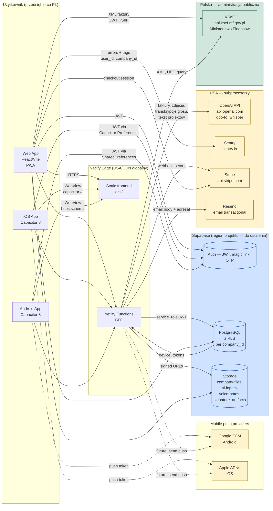

# 02 — Mapa przepływu danych (Data Flow Map)

## Diagram

---

## Opis przepływów (z cytatami z kodu)

### 1. Auth (logowanie)
- **Web:** `src/shared/lib/supabase.ts:13–22` — `createClient(url, anonKey, { auth: { storage: nativeAuthStorage, persistSession: true, autoRefreshToken: true, detectSessionInUrl: true } })`.
- **Native:** sesja przechowywana w iOS Keychain / Android SharedPreferences via `@capacitor/preferences` (`src/shared/lib/nativeAuthStorage.ts`).
- **Magic link / OTP:** Supabase Auth — link kierowany na `loftdesk.pl/auth/callback` (Universal Links / App Links via `assetlinks.json` i `apple-app-site-association`).

### 2. Faktury — przepływ AI parsing
1. Użytkownik upload faktury (PDF/JPEG/PNG/HEIC) → bucket `ai-inputs` (mig. 083).
2. Frontend → `/api/portal/parse-invoice-ai` → `netlify/functions/parse-invoice-ai.ts:340`.
3. Function pobiera plik z `ai-inputs` przy użyciu `SUPABASE_SERVICE_ROLE_KEY`.
4. Treść (tekst lub base64 image) wysyłana do `https://api.openai.com/v1/responses` (`shared/openai-retry.ts:67`) z modelem `gpt-4o` (default, `parse-invoice-ai.ts:442`).
5. Wynik (JSON) zapisywany do `ai_extraction_results` / `expense_invoices`.
6. **Region przetwarzania OpenAI:** USA (default zone). **Trening na danych:** wyłączony domyślnie dla API od marca 2023, ale wymaga formalnej DPA podpisanej przez Administratora.

### 3. Zdjęcia z budowy → analiza pomieszczeń
- `analyze-room-photo.ts:540`, `analyze-project*.ts` — vision API OpenAI (`gpt-4o`/`gpt-4o-mini`).
- Bucket: `ai-inputs`.
- Wysyłane jako image_url base64.

### 4. Notatki głosowe → transkrypcja
- `voice-extract.ts:29` (chat completions), `voice-to-{estimate,expense,note}.ts:84` (Whisper transcriptions).
- Endpoint: `https://api.openai.com/v1/audio/transcriptions` + `https://api.openai.com/v1/chat/completions`.
- Plik audio: bucket `voice-notes` (mig. 128, 1y signed URL TTL).

### 5. Płatności
- Frontend → `stripe-checkout.ts:56` (z JWT) → Stripe Checkout Session.
- `stripe-webhook.ts:135–150` — `stripe.webhooks.constructEvent` z `STRIPE_WEBHOOK_SECRET` ✅.
- Customer portal: `stripe-portal.ts`.

### 6. KSeF
- Auth: `ksef-auth.js`, `ksef-session.js` — token zwracany do frontu i zapisywany w `localStorage['loftdesk.ksef.session.v2']` (`useKsefSession.ts:58`) ⚠️.
- Wysyłka: `ksef-send.js` → `https://api.ksef.mf.gov.pl/online/Invoice/Send`.
- Audit: tabela `ksef_events` (mig. 136), pole `ksef_last_error` (mig. 135).

### 7. E-mail (Resend)
- `send-invitation.ts:121`, `send-document.ts:184`, `notify-approval-response.ts:144`, `check-overdue-invoices.ts:234`.
- Endpoint: `https://api.resend.com` (USA).
- Adresat + treść wiadomości przekazywane do Resend.

### 8. Telemetria błędów (Sentry)
- `src/shared/lib/monitoring.ts:65–113`.
- Tag: `loftdesk.area`, `loftdesk.company_id`, `loftdesk.role`, `loftdesk.plan`, `loftdesk.route`.
- User: `Sentry.setUser({ id: user.id })` — UUID, ale **w połączeniu z stack trace może zidentyfikować osobę**.
- `tracesSampleRate: 0.2 w prod` (sampling 20% wszystkich transakcji).
- Brak `beforeBreadcrumb` scrubbera dla URL/body — wycieki możliwe.

### 9. Push notifications
- `@capacitor/push-notifications` zarejestrowany w `capacitor.config.ts:63`.
- Token zapisany w `device_tokens` (mig. 166) z platformą `ios|android|web`.
- Wysyłka push: **NOT IMPLEMENTED** w Netlify Functions — tabela istnieje, ale brak funkcji `send-push`.
- Po implementacji: tokeny będą przekazywane do FCM (`https://fcm.googleapis.com`) i APNs (`https://api.push.apple.com`).

### 10. Cookies / localStorage
- Wyłącznie techniczne. Lista pełna w `01-data-inventory.md` § C.

---

## Klasyfikacja przepływów wg art. 44–49 RODO

| Przepływ | Kraj docelowy | Mechanizm transferu |
|---|---|---|
| Supabase | UE lub US (zależnie od regionu projektu) | Region UE → brak transferu; US → SCC + DPF |
| Netlify | US/CDN | SCC + DPF |
| OpenAI | US | SCC (https://openai.com/policies/data-processing-addendum) + DPF (od 2023) — **wymaga podpisanego DPA** |
| Stripe | IE/US | SCC + DPF |
| Sentry | US (default `*.ingest.sentry.io`) lub UE (`*.ingest.de.sentry.io` — zalecane) | SCC; **rekomendacja: użyć regionu UE** |
| Resend | US | SCC + DPF |
| FCM | US (Google) | SCC + DPF |
| APNs | US (Apple) | SCC + DPF |
| KSeF | PL | brak transferu poza EOG |
